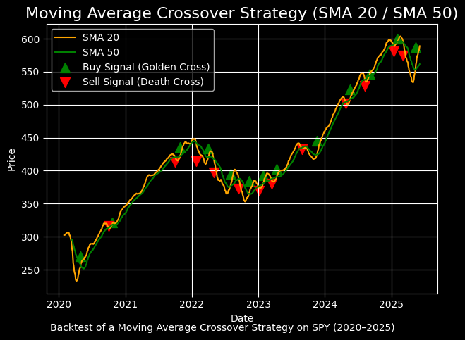

# moving-avg-crossover
# 📈 Moving Average Crossover Strategy (Python)

This project backtests a simple Moving Average Crossover Strategy on SPY data (2020–2025).

---

## 🔍 Strategy Logic:

- **Buy Signal (Golden Cross):** When 20-day SMA crosses above 50-day SMA  
- **Sell Signal (Death Cross):** When 20-day SMA crosses below 50-day SMA

---

## 🧰 Tools Used:

- Python  
- pandas  
- matplotlib
- yfinance
- numpy
- datetime

---

## 📊 Chart Output:

The final chart visualizes:
- SMA 20 (orange) and SMA 50 (green)
- Buy (↑) and Sell (↓) signals on the price curve

---

## 📁 Files:

- `MAC_trBot.ipynb` – Python code for the backtest and plotting  
- `output_chart.png` – Final output chart  
----
Historical SPY data downloaded through yfinance module.

---

